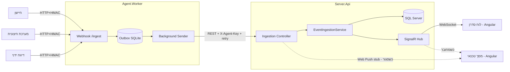
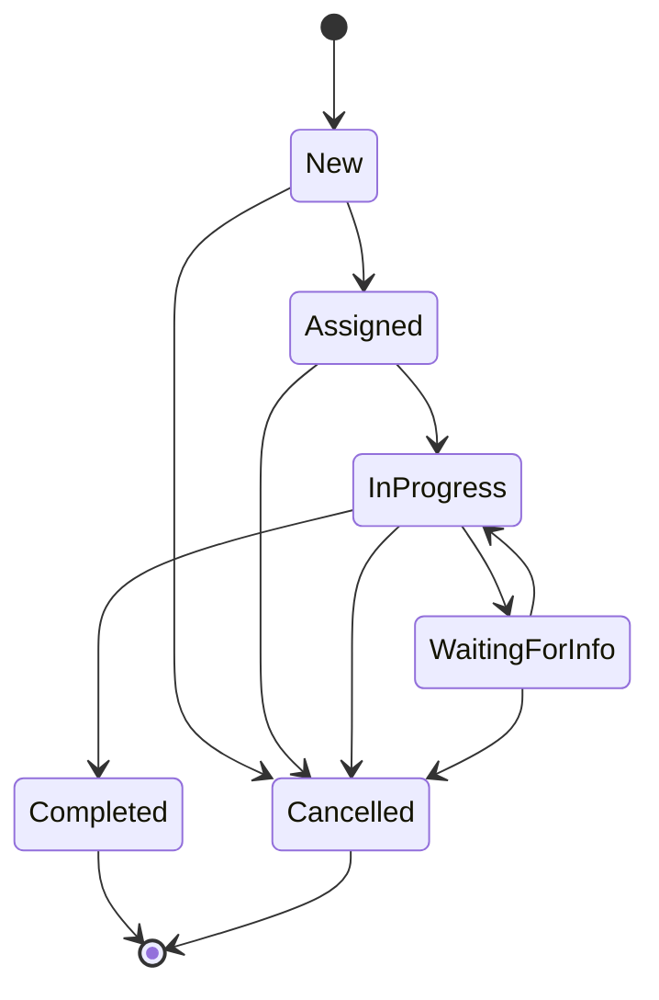

# מסמך ארכיטקטורה — Field Event Management System

מסמך זה מתאר את הארכיטקטורה, גבולות האחריות בין הרכיבים, וההחלטות הטכנולוגיות המנומקות.

---

## 1. סקירה כללית

מערכת לניהול אירועי שטח בזמן אמת. אירועים מגיעים ממקורות הטרוגניים (חיישנים, מערכות, דיווח ידני), נאספים ע"י **Agent**, מועברים ל**שרת מרכזי** שמנהל את הלוגיקה העסקית ומסד הנתונים, ומוצגים ל**סדרנים ולטכנאים** ב-real-time.

**מאפיין מעצב:** כל אירוע = מידע קטן (כותרת, תיאור, מקור, מיקום). אין נפחים/קבצים/תמונות. לכן המיטוב הוא ל-**latency ואמינות**, לא ל-throughput.

---

## 2. תרשים ארכיטקטורה



---

## 3. הרכיבים וגבולות האחריות

| רכיב | אחריות | לא באחריותו |
|---|---|---|
| **Agent.Worker** | קבלת דיווחים ממקורות, אימות מקור (HMAC), שמירה ב-Outbox, שידור אמין לשרת | לוגיקה עסקית, State Machine, DB מרכזי |
| **Server.Api** | קליטת אירועים, State Machine, הרשאות, real-time, שמירת נתונים+היסטוריה | קבלה ישירה ממקורות חיצוניים |
| **Domain** | ישויות, State Machine, חוקי מעברים | תשתית (EF/SignalR/HTTP) |
| **Application** | use-cases + הגדרת ports (interfaces) | מימוש קונקרטי של DB/רשת |
| **Infrastructure** | מימוש ה-ports: EF Core, JWT, hashing, WebPush | הגדרת חוקי עסק |
| **Frontend** | תצוגה, קבלת עדכונים real-time, ניתוב לפי תפקיד | אכיפת הרשאות (מתבצעת בשרת) |

**עקרון Clean Architecture:** התלות זורמת פנימה — `Api → Infrastructure → Application → Domain`. ה-Domain לא מכיר אף ספרייה חיצונית, ולכן ה-State Machine בר-בדיקה ללא DB, וניתן להחליף מימושים (למשל WebPush stub) ללא נגיעה בלוגיקה.

---

## 4. ה-Agent — פירוט

**חשיפה לעולם:** endpoint HTTP יחיד `POST /ingest`. כל מקור שולח POST עם כותרות אימות. חיבור מקור חדש = רישום שם+מפתח, ללא שינוי קוד.

**צורת מימוש ה-Agent — חלופות שנשקלו (לפי דרישת האפיון):**

| חלופה | יתרונות | חסרונות | הכרעה |
|---|---|---|---|
| **.NET Generic Host יחיד** — Minimal-API webhook + `BackgroundService` (Outbox sender) בתהליך אחד | פשטות תפעול (תהליך אחד רציף); webhook HTTP שכל מקור הטרוגני מדבר בקלות; Outbox עמיד בין הרצות; ללא תלות ענן | דורש אירוח (שירות/קונטיינר) שרץ תמידית | **נבחר** |
| Serverless — Function-per-trigger (Azure Functions / Lambda) | scale-to-zero, אין שרת לתחזק | cold-start פוגע ב-latency; Outbox עמיד בין הרצות קצרות-חיים מורכב; תלות ספק ענן | נדחתה |
| Consumer של Message Broker — Agent שצורך מתור (RabbitMQ/Kafka) שהמקורות דוחפים אליו | ניתוק (decoupling) ו-buffering מובנה | רכיב תפעולי כבד שלא מוצדק לנפח קטן; המקורות (חיישנים/דיווח ידני) מדברים HTTP טבעי, לא AMQP | נדחתה |

**נימוק:** תהליך רציף יחיד שמאחד קליטה (webhook) ושידור אמין (BackgroundService+Outbox) נותן את שלושת ה-yardsticks שהאפיון מבקש — **הרחבה** (מקור חדש = config בלבד), **אמינות** (Outbox + retry), ו**תחזוקה** (בסיס קוד אחד, ללא תשתית ענן/תור). התקשורת עם השרת (REST) מנומקת בנפרד ב-§10.

**אימות מקור:** `X-Api-Key` (מזהה) + `X-Signature` (HMAC-SHA256 על `timestamp.body`) + `X-Timestamp` (חלון 5 דקות נגד replay).

**אמינות (Outbox):**
```
מקור → [1. כתיבה ל-SQLite מקומי] → 202 Accepted
                                         ↓ (אסינכרוני)
        Background Sender → POST לשרת → 200? סימון Sent : retry (backoff מעריכי)
```
האירוע נשמר **לפני** השליחה → גם אם השרת/DB נפולים, האירוע לא נאבד. `IdempotencyKey` מבטיח at-least-once ללא כפילויות.

---

## 5. State Machine



- המעברים מוגדרים בקוד (`EventStateMachine`) — **לא ניתן להגיע לכל מצב מכל מצב**. מעבר לא חוקי זורק `InvalidEventTransitionException`.
- כל מעבר נשמר ב-`EventStatusHistory` עם **חותמת זמן + משתמש מבצע**, בטרנזקציה אחת עם עדכון האירוע.
- מכוסה ב-Unit Tests (`tests/Domain.Tests`).

---

## 6. מודל נתונים (ERD)

```mermaid
erDiagram
    Users ||--o{ Events : "assigned to"
    Users ||--o{ PushSubscriptions : has
    EventSources ||--o{ Events : reports
    Events ||--o{ EventStatusHistory : tracks

    Users { guid Id PK; string Name; string Username; string PasswordHash; enum Role; bool IsConnected }
    Events { guid Id PK; string Title; string Description; string Location; guid SourceId; string IdempotencyKey UK; enum Status; enum Priority; guid AssignedTechnicianId }
    EventStatusHistory { guid Id PK; guid EventId FK; enum FromStatus; enum ToStatus; guid ChangedByUserId; datetime ChangedAt; string Note }
    EventSources { guid Id PK; string Name; string ApiKey UK; string SecretHash; bool IsActive }
    PushSubscriptions { guid Id PK; guid UserId FK; string Endpoint; string P256dh; string Auth }
```

בצד ה-Agent קיים מסד נפרד (SQLite) עם טבלת `Messages` (Outbox).

---

## 7. תקשורת בזמן אמת + התראות

| | משתמש מחובר (דפדפן פתוח) | משתמש לא מחובר (דפדפן סגור) |
|---|---|---|
| ערוץ | **SignalR** (WebSocket) | **Web Push** (VAPID) דרך Service Worker — *stub* |
| מקור אמת ל"מצב" | נוכחות חיבור SignalR (שדה `User.IsConnected` ב-DB) | נגזר: אין חיבור פעיל → נשלח push |

- **איך השרת יודע את המצב:** ה-Hub מעדכן נוכחות ב-`OnConnected/OnDisconnected`.
- **שמירת Subscription:** הלקוח נרשם ל-Push ושולח endpoint+keys לשרת → `PushSubscriptions`.
- **מומש בפועל:** דחיפת אירוע חדש לסדרן ב-SignalR (חלק מה-Flow). Web Push מוגדר כ-`IPushNotifier` עם מימוש stub (§11 בדרישות מאפשר זאת).

---

## 8. אבטחה ואימות

| ערוץ | מנגנון |
|---|---|
| משתמש → שרת | JWT Bearer, role-based, אכיפה **בצד שרת** (טכנאי רואה רק אירועים שלו — סינון ב-query) |
| מקור → Agent | API Key + HMAC על הגוף + timestamp (anti-replay) |
| Agent → שרת | מפתח פנימי `X-Agent-Key` |
| כל הערוצים | TLS/HTTPS (WSS ל-SignalR); dev-cert בפיתוח |

**למה אימות המקור שונה מאימות המשתמש:** משתמש = בן אדם עם login וסשן קצר (JWT). מקור = מכונה ללא login, עם סוד קבוע שחותם על כל בקשה. שני מודלים שונים לשתי בעיות שונות.

---

## 9. התנהגות בכשל רכיב

| רכיב נופל | התנהגות |
|---|---|
| שרת מרכזי | Agent שומר ב-Outbox + retry → אין אובדן; idempotency מונע כפילות בשידור חוזר |
| DB של השרת | השרת מחזיר 5xx → Agent לא מסמן Sent → נשאר ב-Outbox |
| Agent | מקורות מקבלים שגיאה; באתחול — Outbox משודר מחדש |
| חיבור SignalR | reconnect אוטומטי; בינתיים Web Push; sync בעת חיבור מחדש |

---

## 10. Trade-offs והחלטות טכנולוגיות מנומקות

| החלטה | נבחר | חלופות שנדחו | נימוק |
|---|---|---|---|
| Backend | ASP.NET Core (.NET 10) | Python/FastAPI | SignalR מובנה, Worker Service, EF Core מול SQL Server |
| Agent→שרת | **REST + Outbox** | gRPC, RabbitMQ | REST פשוט וקל לדיבוג; validation דרך DataAnnotations. gRPC = מורכבות מיותרת לנפח קטן; RabbitMQ = רכיב תפעולי מיותר |
| Real-time | SignalR | WebSocket גולמי, SSE | reconnect + groups + fallback מובנים |
| Push (סגור) | Web Push + VAPID | FCM, Email/SMS | תקן ללא תלות ספק; FCM = תלות Google |
| DB | SQL Server (Code-First) | Database-First | migrations אוטומטיים, הקוד מקור האמת, קל להרצה אצל הבוחן |
| DB לפיתוח | LocalDB (+Docker כאופציה) | Docker בלבד | LocalDB זמין מיידית; Docker ניתן לניידות |
| אימות משתמש | JWT | Sessions, OIDC | stateless, מתאים ל-API+SignalR; OIDC = overkill |
| אימות מקור | API Key + HMAC | mTLS | ללא תשתית PKI; קל לתעד |

---

## 11. בונוס — תמיכה ב-Offline (High-Level)

- **אחסון מקומי:** אירועי הטכנאי + פעולות ממתינות ב-IndexedDB (דרך Service Worker).
- **סנכרון בחזרה:** תור פעולות מקומי (Background Sync) שמשודר עם חזרת החיבור, עם idempotency keys (כמו ה-Outbox של ה-Agent).
- **קונפליקטים:** גרסה/`UpdatedAt` לכל אירוע; last-write-wins עם התראה, או merge לפי שדה. מעברי State מתנגשים נפתרים ע"י ה-State Machine — מעבר לא חוקי מהצד שחזר נדחה ומדווח.

---

## 12. שימוש בכלי AI

ראה מקטע ייעודי ב-[README](../README.md#שימוש-בכלי-ai-שקיפות--חלק-מהמבחן): הפתרון פותח בעזרת Claude, עם שיקול דעת ביקורתי — כולל שינוי מנומק מ-gRPC ל-REST ודחיית RabbitMQ/FCM/Docker-as-default.
